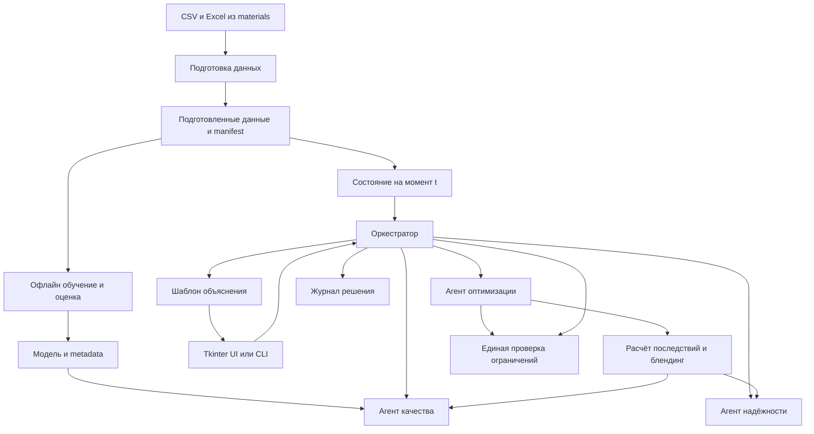
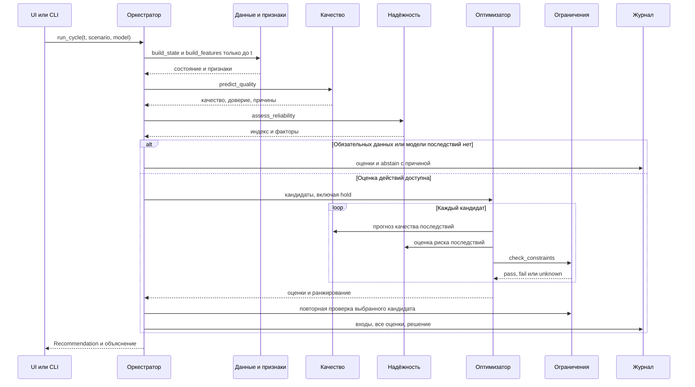

# Технический дизайн системы рекомендаций Нефтекода

Версия контракта: **1.0**. Статус: **частично реализованная спецификация**.

Документ содержит целевую архитектуру. Актуальный runtime: Stages 0–10, полный
синтетический паспорт S/T95/CN с присадкой в Tkinter UI и CLI для frozen
training/evaluation/replay. UI также умеет выполнить history-replay доверенного
forecast artifact, исследовательский P8/F19 scenario и отдельный ПАК--ЛИМС
контроль; schema 1.2 и action-effect остаются shadow/read-only.

Основания: [техническое задание](materials/ТЗ_нефтекод.docx), [материалы](materials/README.md), [поэтапный план](IMPLEMENTATION_PLAN.md). ТЗ определяет обязательные требования, этот документ — технические контракты, план — порядок реализации. При изменении контракта документ и тестовые примеры обновляются в том же PR.

## 1. Зафиксированные решения

| Вопрос | Решение для версии 1 |
| --- | --- |
| Команда и ресурсы | Два исполнителя (человека или агента): backend и ML; 1–2 недели; CPU; без обязательных платных API |
| Развёртывание | Одно локальное Python-приложение; toolchain нацелен на Python 3.11, локальный Stage-5 artifact собран в Python 3.12.3 |
| Мультиагентность | Агент качества, агент надёжности, агент оптимизации и оркестратор с явными входами и выходами |
| Взаимодействие | Синхронные вызовы Python-функций в одном процессе; структурированные результаты |
| UI | Tkinter desktop UI для model-demo; CLI для `prepare`, `build-state` и demo |
| Хранение | Исходные файлы; подготовленные CSV.gz; артефакты модели; JSON/JSONL с результатами |
| Модели | Сохранение последнего значения → Ridge → HistGradientBoostingRegressor; улучшение допускается по результатам временной валидации |
| Оптимизация | Детерминированный ограниченный перебор; жёсткий фильтр перед ранжированием |
| Блендинг | Модель S/T95/CN, сценарные границы и конфигурируемая цетановая присадка |
| Объяснение | Шаблон из численных результатов и причин проверок; не влияет на решение |
| Управление установкой | Только рекомендации оператору; команд исполнительным устройствам нет |

Q&A 11.09 подтверждает локальный запуск без внешнего интернета и допустимость
обоснованных инженерных моделей без обязательной LLM. Данные, зависимости и модели
готовятся до переноса в закрытую среду; наличие внутренней LLM не является обещанием
ресурсов команде. Основания и открытые вопросы: [разбор встречи](QA_CLARIFICATIONS.md).

В версии 1 не вводятся HTTP API, брокер сообщений, микросервисы, СУБД, оркестратор LLM, обучение в интерфейсе или собственный фреймворк агентов. Новые зависимости: `openpyxl` для Excel; `tzdata` для часовых поясов на Windows, где системная база IANA может отсутствовать ([документация Python](https://docs.python.org/3.11/library/zoneinfo.html)). Остальной обязательный стек уже указан в репозитории.

### Три режима работы

| Режим | Что является фактом | Что система вправе утверждать |
| --- | --- | --- |
| `history` | Исторические измерения, доступные к выбранному моменту | Текущее состояние, прогноз и предупреждения. Изменения реальных уставок разрешены только при прошедшей проверку модели последствий |
| `model_demo` | Численные входы из сценария, помеченные как модельные | Допустимость и эффект внутри объявленной модели; не промышленная гарантия |
| `hybrid` | История АВТ/гидроочистки плюс модельная рецептура | Прогноз качества реального потока и условный результат его модельного смешения |

Прогноз `y(t + h)` на истории и оценка `y(t + h | действие)` — разные возможности. У модели отдельные признаки `supports_forecast` и `supports_actions`. Хороший MAE не включает вторую возможность автоматически. При `supports_actions=false` оптимизатор не подставляет новые уставки в обычный предиктор.

В режиме `history` без модели последствий возвращается `abstain` с причиной `ACTION_MODEL_UNAVAILABLE`, но оценки состояния и качества сохраняются и показываются. Проверенный пример `hold` демонстрируется в `model_demo`; после проверки модели последствий он доступен и на истории.

## 2. Компоненты и зависимости



Диаграмма — поток данных и вызовов, не сетевые сервисы. Результат возвращается через `return`.

### Правила импортов

- `contracts.py` не импортирует другие модули проекта.
- `config.py` зависит только от контрактов и стандартного чтения TOML/JSON.
- `data/*` и `ml/features.py` не импортируют UI, оркестратор или оптимизатор.
- `ml/train.py` и `ml/evaluate.py` используются только офлайн; при открытии UI они не импортируются.
- `agents/*` используют контракты, признаки и численные модели, но не UI и не журнал.
- `constraints.py` — единственная реализация жёстких проверок; его вызывают оптимизатор и оркестратор.
- `orchestrator.py` координирует расчёт, не содержит формул обучения и смешения.
- `main.py` и `ui.py` собирают зависимости явно и вызывают общий `run_cycle`; DI-контейнер не нужен.
- Только слой подготовки пишет подготовленные данные; только обучение пишет модели; только `journal.py` пишет журналы решений.

## 3. Структура файлов и владельцы

Файлы создаются по этапам, без пустых заготовок «на будущее».

```text
HackathonPetrolCode/
├── README.md                         # запуск и ограничения готовой версии
├── IMPLEMENTATION_PLAN.md            # сроки, этапы и критерии готовности
├── DESIGN.md                         # архитектура и контракты
├── pyproject.toml                    # Ruff и pytest; заменяет config.toml
├── requirements.txt                  # проверенные зависимости Python 3.11
├── .github/workflows/ci.yml          # проверки кода и малых сценариев
├── config/
│   ├── runtime.toml                  # общие экспериментальные настройки
│   ├── tags.csv                      # подтверждённые соответствия и единицы
│   └── scenarios/
│       ├── history.json              # режим истории; реальные controls отключены
│       ├── blend_normal.json         # нормальный модельный период
│       ├── blend_risk.json           # модельное превышение серы
│       ├── blend_t95_risk.json       # модельное превышение T95
│       ├── blend_cetane_risk.json    # модельный дефицит цетанового числа
│       └── blend_missing.json        # модельная нехватка данных
├── source/
│   ├── __init__.py
│   ├── main.py                       # CLI и сборка зависимостей
│   ├── ui.py                         # Tkinter; model-demo и диагностические команды
│   ├── contracts.py                  # Pydantic-типы обмена
│   ├── config.py                     # чтение и валидация настроек
│   ├── constraints.py                # единый фильтр допустимости
│   ├── orchestrator.py               # run_cycle и выбор результата
│   ├── explain.py                    # русские шаблоны объяснений
│   ├── journal.py                    # JSON/JSONL и атомарная запись
│   ├── data/
│   │   ├── __init__.py
│   │   ├── ingest.py                 # чтение исходных CSV и Excel
│   │   ├── prepare.py                # нормализация, manifest, диагностика
│   │   └── state.py                  # доступные на момент t данные
│   ├── ml/
│   │   ├── __init__.py
│   │   ├── features.py               # общие признаки обучения и применения
│   │   ├── train.py                  # baselines, подбор, сохранение модели
│   │   ├── evaluate.py               # временная оценка и отчёты
│   │   └── artifacts.py              # ModelBundle, загрузка и metadata
│   └── agents/
│       ├── __init__.py
│       ├── quality.py                # текущее качество и прогноз
│       ├── reliability.py            # тяжесть режима и объясняющие факторы
│       ├── optimizer.py              # кандидаты, оценка и ранжирование
│       └── effects.py                # последствия действий и формулы смеси
├── global_tests/
│   ├── workflow_test.py              # существующий smoke заменяется запуском цикла
│   ├── test_data.py                  # источники, единицы, время
│   ├── test_features.py              # отсутствие утечек и train/serve parity
│   ├── test_decisions.py             # ограничения, выбор, отказы
│   ├── test_artifacts.py             # несовместимые и отсутствующие модели
│   └── fixtures/                    # малые синтетические данные для CI
├── materials/                        # неизменяемые выданные материалы
├── data/processed/<dataset_id>/       # локальные производные данные
├── artifacts/models/<model_id>/       # локальные артефакты моделей
├── reports/<evaluation_id>/           # метрики и параметры эксперимента
└── runs/<run_id>/                     # воспроизводимый журнал одного запуска
```

| Владелец | Файлы и обязательства |
| --- | --- |
| Backend | `main`, `ui`, `contracts`, `config`, `constraints`, `orchestrator`, `explain`, `journal`, `data/*`, CI и запуск |
| ML | `ml/*`, `agents/*`, смысл `tags.csv`, формулы, выбранные ограничения, модельные сценарии и отчёты |
| Общие файлы с одним автором | `contracts.py`, `runtime.toml`, зависимости и этот дизайн редактирует backend после согласования семантики с ML; `tags.csv` и JSON-сценарии редактирует ML после проверки совместимости с backend |

Backend не дублирует признаки в UI; ML не пишет альтернативный загрузчик данных в ноутбуке. Ноутбуки — для исследования; итоговый запуск использует указанные `.py`-модули.

Производные данные, модели и журналы исключаются из обычного Git. Малые синтетические fixtures, настройки, отчёты с агрегированными метриками и документация могут храниться в Git. Существующий `materials/data.rar` остаётся в Git LFS; его не дублируют распакованными CSV в коммитах.

## 4. Подготовленные данные и время

### Форматы на диске

| Файл в наборе данных | Формат и назначение |
| --- | --- |
| `telemetry.csv.gz` | Одна строка на timestamp; `timestamp` и численные колонки с ключами `avt:T33`, `ht:F26` и т. п. |
| `quality.csv.gz` | Длинная таблица: `observation_id, signal_id, stage, source, measured_at, available_at, value, unit, validity, source_ref` |
| `issues.csv.gz` | `source_ref, code, detail`; ошибки и конфликты исходников, без молчаливого удаления |
| `manifest.json` | SHA-256 исходников, настроек и словаря; временные диапазоны, число строк, версия подготовки, допущения |

`dataset_id` — первые 12 символов SHA-256 от отсортированного списка полных хешей исходников, конфигурации подготовки, словаря и версии кода подготовки. Полные хеши сохраняются в manifest; при совпадении короткого ID и разных полных хешах запись запрещается. Кэш переиспользуется только при полном совпадении manifest.

### Нормализация

1. RAR распаковывается локально в отдельный каталог; ожидаются только `data/avt_tags.csv` и `data/242000_tags.csv`. Имена и пути проверяются до извлечения. Исходный архив остаётся неизменным. Для Windows использовать доступный `tar`, для Linux в инструкции указать `bsdtar`.
2. CSV объединяются по `date`. Из первой таблицы удаляются `Unnamed:*`, из второй — пустой индексный заголовок. Технологические теги получают префикс установки.
3. Excel читается по заголовкам точек и показателей. Каждая пара «время — значение» преобразуется независимо; номера строк разных показателей не связываются.
4. `Pt Created`, текст вместо числа, бесконечности и повреждённые даты получают запись в `issues`. Численное значение становится отсутствующим, не нулём.
5. Одинаковые дубликаты схлопываются с сохранением происхождения. Противоречащие значения одного источника в один момент получают `conflict` и не выбираются произвольно.
6. Единицы преобразуются только по подтверждённому правилу: массовые ppm → мг/кг без изменения числа; массовые проценты серы → мг/кг умножением на 10 000. Для неоднозначного `ppm` сначала подтверждается массовая база. Массовый и объёмный расход не отождествляются.
7. Значения вне привычного диапазона не удаляются автоматически. Ошибка датчика, насыщение анализатора и реальная аварийная ситуация различаются только при наличии основания; иначе остаётся предупреждение.

### Словарь тегов

`config/tags.csv` содержит поля `signal_id, raw_name, stage, meaning, raw_unit, canonical_unit, conversion, mapping_status, controllable, evidence_ref`.

- `mapping_status`: `confirmed`, `ambiguous`, `excluded`.
- `conversion`: именованная функция из фиксированного набора, а не исполняемая строка.
- `controllable=true` требует подтверждения в `evidence_ref`; наличие численного ряда этого не подтверждает.
- В формулах и UI используются канонические ключи. Короткие имена вроде `T6` не определяют физический смысл.
- Некорректную формулу ВАК не исправляют догадкой. Её исключают до проверки; утверждённые формулы переносят в явные Python-функции, без `eval` содержимого Excel.

### Временные правила

Точки ЛИМС АВТ — разные физические места/стадии, не варианты времени одного анализа
(Q&A 11.09, 00:09:33). Общая подпись «Дизельное топливо» не разрешает объединять точки.
Новые схемы организаторов от 14.09 локализуют короткие `avt:*` на К-1, К-2 и К-10
и подтверждают внутренний маршрут АВТ до продуктовой ветви ДТ 240-350 °C. Они не
привязывают ЛИМС 1/2/2.1/3 к стрелкам, не показывают маршрут/резервуар до 24-2000
и не подтверждают теги `ht:*`; имя `Pipeline` также остаётся открытым вопросом.
Подробная карта и границы: [разбор схем](SCHEME_ANALYSIS_2026_09_14.md).

Внутри приложения — timezone-aware UTC. Исходные даты без timezone интерпретируются согласно `source_timezone`. `Europe/Moscow` по умолчанию — **экспериментальное допущение**, не установленное свойство пакета; записывается в manifest. UI показывает часовой пояс рядом со временем.

- `measured_at` — время измерения/отбора пробы.
- `available_at` — время, с которого результат мог быть известен системе.
- Для телеметрии и ПАК начальное допущение: `available_at = measured_at`.
- Для ЛИМС при отсутствии точного времени публикации: `available_at = measured_at + lims_delay_hours`. По ответу эксперта от 10.09.2026 публикация занимает до 4 часов; консервативное значение по умолчанию — 4 часа. Чувствительность к меньшей задержке оценивается без подбора на финальном test.
- В состоянии на `t` разрешены только записи с `measured_at <= t` и `available_at <= t`.
- Возраст всегда считается от `measured_at`, не от времени загрузки файла.
- Для каждого сигнала выбирается последнее доступное измерение по времени.
- Начальные пределы свежести: телеметрия 20 минут, ПАК 30 минут, ЛИМС 48 часов. Это модельные настройки, проверяемые на валидации, а не технологические нормативы.
- Пригодный свежий ЛИМС имеет приоритет над ПАК; затем идёт проверенный ВАК. Остальные источники сохраняются для сравнения.
- Устаревший ЛИМС показывается отдельно. Свежий пригодный ПАК может стать оперативным источником с предупреждением; устаревший анализ не становится текущей истиной.
- Расхождение источников не проверяется на произвольных несинхронных значениях: ПАК сопоставляется с временем отбора лабораторной пробы, но сам факт конфликта появляется только после `available_at` ЛИМС. Допуск расхождения обязателен в настройках активного показателя; неподтверждённый допуск не придумывается в коде.
- Неразрешённый конфликт обязательного показателя блокирует рекомендацию. Лабораторный результат остаётся контрольным фактом.

Отсутствие необязательного сигнала даёт предупреждение. Отсутствие обязательного входа модели или ограничения блокирует соответствующий расчёт. Условия определяются явно в scenario/model metadata.

## 5. Типы обмена между компонентами

Типы реализуются в `contracts.py` через Pydantic. Числа конечны; отсутствие — `None`. Во внешнем JSON — `null`, никогда `NaN`. Неизвестные поля отклоняются. Строковые перечисления сериализуются своими значениями. Агентам передаются новые результаты; они не меняют входной `ProcessState` и конфигурацию.

Обозначения: `Timestamp` — timezone-aware `datetime`; `SignalId`, `CandidateId` и `RunId` — строки; `Unit` — каноническая строка единицы. Поля таблиц обязательны; `| None` разрешает отсутствие значения, но поле остаётся в JSON.

### Состояние и измерения

| Тип | Поля |
| --- | --- |
| `Issue` | `code: str`, `severity: Literal['warning','blocking']`, `signal_id: str \| None`, `detail: str`, `source_ref: str \| None` |
| `Observation` | `id: str`, `signal_id: str`, `stage: Literal['avt','ht','blend']`, `source: Literal['telemetry','lims','pak','vak','scenario']`, `measured_at: Timestamp`, `available_at: Timestamp`, `value: float \| None`, `unit: str`, `validity: Literal['valid','missing','invalid','conflict']`, `source_ref: str` |
| `SignalSnapshot` | `selected: Observation \| None`, `alternatives: list[Observation]`, `age_seconds: float \| None`, `fresh: bool`, `issues: list[Issue]` |
| `ProcessState` | `schema_version: Literal['1.0']`, `state_id: str`, `as_of: Timestamp`, `dataset_id: str`, `mode: Literal['history','model_demo','hybrid']`, `signals: dict[str, SignalSnapshot]`, `issues: list[Issue]` |

`signals` содержит все ожидаемые сценарием сигналы, в том числе отсутствующие. Исторические окна для модели не вкладываются целиком в состояние: признаки строятся через ограниченный моментом `as_of` доступ к подготовленным данным и отдельно сохраняются в журнале.

### Действия, оценки и проверки

| Тип | Поля |
| --- | --- |
| `CandidateAction` | `id: str`, `kind: Literal['hold','setpoints','blend']`, `setpoints: dict[str,float]`, `blend_mass_fractions: dict[str,float]`, `additive_mass_fraction: float`, `horizon_minutes: int`, `is_model_scenario: bool` |
| `MetricEstimate` | `value: float \| None`, `lower: float \| None`, `upper: float \| None`, `unit: str`, `basis: Literal['measured','forecast','formula','proxy']`, `interval_kind: Literal['none','empirical','scenario_bound']`, `interval_level: float \| None`, `reference: str`, `assumptions: list[str]` |
| `AgentAssessment` | `agent: Literal['quality','reliability','optimizer']`, `state_id: str`, `candidate_id: str`, `evaluated_for: Timestamp`, `status: Literal['ok','degraded','unavailable']`, `metrics: dict[str,MetricEstimate]`, `issues: list[Issue]` |
| `ConstraintResult` | `constraint_id: str`, `candidate_id: str`, `status: Literal['pass','fail','unknown']`, `actual: float \| None`, `lower: float \| None`, `upper: float \| None`, `unit: str \| None`, `basis: Literal['tz','confirmed','model_assumption']`, `evidence_ref: str`, `reason_code: str` |
| `CandidateEvaluation` | `candidate: CandidateAction`, `assessments: list[AgentAssessment]`, `checks: list[ConstraintResult]`, `feasible: bool`, `rank_key: tuple[float,float,float,float,str] \| None` |

Правила:

- `setpoints` содержит **новые абсолютные значения**, не приращения; единицы определяются `ControlSpec`. Разницу UI вычисляет относительно состояния.
- Для `hold` обе карты пустые: сохраняются текущие уставки, рецептура и доза присадки. Для `blend` задаётся полная рецептура и доза, не только изменения. Сумма долей компонентов и присадки равна 1. Кандидат не совмещает изменение уставок и рецептуры.
- У всех оценок кандидата совпадают `state_id`, `candidate_id` и горизонт. Прогноз вычисляется на `as_of + horizon`; измерение текущего состояния подписывается отдельно.
- `MetricEstimate` с `basis='proxy'` не называется физической величиной без установленного соответствия. Прокси затрат имеют единицу `proxy_unit`, риска — `index_0_1`.
- `interval_kind='scenario_bound'` — заданная граница сценария, не статистическая вероятность. `interval_level` для неё равен `None`.
- `feasible=true` только если все обязательные проверки имеют `pass`. `unknown` не равно успешной проверке. При отсутствии обязательной оценки `rank_key=None`.

### Итог цикла

| Тип | Поля |
| --- | --- |
| `Recommendation` | `schema_version: Literal['1.0','1.1']` (новая выдача `1.1`, чтение старых журналов `1.0` сохранено), `run_id: str`, `state_id: str`, `as_of: Timestamp`, `scenario_id: str`, `mode: str`, `status: Literal['recommend','hold','abstain']`, `baseline: CandidateEvaluation \| None`, `selected: CandidateEvaluation \| None`, `alternatives: list[CandidateEvaluation]`, `reason_codes: list[str]`, `explanation: str`, `assumptions: list[str]`, `model_id: str \| None` |
| `RunFailure` | `run_id: str`, `occurred_at: Timestamp`, `error_code: str`, `stage: str`, `message: str` |

Инварианты: при `recommend` выбран допустимый ненулевой кандидат; при `hold` выбран допустимый кандидат `hold`; при `abstain` `selected=None` и есть причина. `baseline` может быть недопустимым — это исходная точка сравнения, а не разрешённое действие. В `alternatives` идут до трёх допустимых альтернатив, полный список сохраняется в журнале.

`RunFailure` — техническая ошибка выполнения, не технологический отказ. Система не превращает исключение Python в ответ «безопасных режимов нет».

## 6. Конфигурация и интерфейсы функций

### Конфигурационные типы

| Тип | Содержание |
| --- | --- |
| `RuntimeConfig` | `source_timezone`, задержки и пределы свежести; `horizon_minutes=60`; `seed=42`; `max_candidates=125`; пути к данным/моделям/журналам |
| `ControlSpec` | `signal_id`, `unit`, `lower`, `upper`, `max_step`, `step`, `evidence_ref`, `basis`, `enabled` |
| `ConstraintSpec` | `id`, `metric`, `stage`, `lower`, `upper`, `unit`, `use_upper_estimate`, `use_lower_estimate`, `required`, `basis`, `evidence_ref` |
| `BlendComponent` | `id`, оценки `sulfur`, `t95`, `cetane_number`, `available_mass_t`, `cost_proxy_per_t`, `risk_index`, `source_state_id` |
| `CetaneAdditiveSpec` | `id`, максимум/шаг/запас/стоимость, монотонная таблица `mass_fraction -> cetane_gain`, источник и допущения |
| `ScenarioConfig` | `id`, `mode`, сигналы, controls, constraints, компоненты, присадка, `total_mass_t`, текущие рецептура/доза, критерии, пороги, cooldown и допущения |
| `DecisionContext` | `last_recommended_at: Timestamp \| None`; время последней выданной рекомендации для подавления повторов |

Численные технологические границы без источника не имеют значения по умолчанию. Тогда `enabled=false`. Активное ограничение без предела, единицы или обоснования — ошибка конфигурации до запуска цикла. В `model_demo` обязательны верхние оценки серы и T95 и нижняя оценка цетанового числа. Сера имеет `upper=10 mg/kg` из ТЗ; T95/CN и их границы явно помечены `model_assumption`.

Доли считаются равными 1 при абсолютной погрешности не более `1e-9`. Этот допуск используется только для арифметики долей, не для разрешения серы выше 10 мг/кг. Сравнение качества выполняется до округления UI.

### Вызываемые интерфейсы

`PreparedData` и `ModelBundle` — обычные локальные dataclass-контейнеры, а не сетевые DTO. `FeatureFrame` — `pandas.DataFrame` с фиксированным порядком признаков.

```text
prepare_dataset(materials_dir: Path, config: RuntimeConfig) -> PreparedData
build_state(data: PreparedData, as_of: datetime,
            scenario: ScenarioConfig, config: RuntimeConfig) -> ProcessState
build_features(data: PreparedData, as_of: datetime,
               state: ProcessState, model: ModelBundle) -> FeatureFrame
predict_quality(state: ProcessState, features: FeatureFrame,
                model: ModelBundle | None, scenario: ScenarioConfig) -> AgentAssessment
assess_reliability(state: ProcessState,
                   scenario: ScenarioConfig) -> AgentAssessment
generate_candidates(state: ProcessState,
                    scenario: ScenarioConfig) -> list[CandidateAction]
evaluate_candidates(state: ProcessState, features: FeatureFrame,
                    candidates: list[CandidateAction], model: ModelBundle | None,
                    scenario: ScenarioConfig) -> list[CandidateEvaluation]
check_constraints(state: ProcessState, candidate: CandidateAction,
                  assessments: list[AgentAssessment],
                  scenario: ScenarioConfig) -> list[ConstraintResult]
run_cycle(data: PreparedData, as_of: datetime, model: ModelBundle | None,
          scenario: ScenarioConfig, config: RuntimeConfig,
          context: DecisionContext, run_dir: Path) -> Recommendation
```

`predict_quality` и `assess_reliability` оценивают исходное состояние с `candidate_id='hold'`. `effects.py` оценивает действие в отдельном прогнозном состоянии/оценках; исходный объект не изменяется. Данные, рассчитанные моделью, получают соответствующий `basis`, а не `measured`.

В `model_demo` без ML-модели `build_features` не вызывается: передаётся пустой `FeatureFrame`, а качество считается из компонентов сценария. Baseline на истории оформляется как `ModelBundle` с явным типом predictor; отсутствие необходимой модели не переключает режим автоматически.

`PreparedData` хранит отсортированную телеметрию, длинную таблицу качества, issues и manifest. `ModelBundle` хранит predictor, порядок признаков, preprocessing, метаданные и при наличии модель последствий. Backend не должен знать внутреннюю структуру sklearn estimator.

## 7. Один цикл принятия решения



Порядок внутри `run_cycle`:

1. Проверить совместимость config/scenario/model и создать `run_id`.
2. Построить состояние и признаки. Сохранить применённые допущения и идентификаторы выбранных наблюдений.
3. Получить оценки качества и надёжности. Если роль недоступна, сохранить доступные результаты остальных.
4. При блокирующих входах вернуть `abstain`; не генерировать видимость оптимизации.
5. Создать `hold` и разрешённые кандидаты. Предварительно отсеять нарушение формата, управления и рецептуры.
6. Рассчитать последствия, затем выполнить полный `check_constraints`. Никакие баллы не используются до этого фильтра.
7. Выбрать лучший допустимый вариант по правилу ниже. При отсутствии вариантов — `abstain`.
8. Повторно проверить выбранный кандидат тем же кодом ограничений. Расхождение результатов — `RunFailure`, а не автоматический переход к другому ответу.
9. Построить объяснение исключительно из сохранённых оценок; записать журнал; вернуть результат UI/CLI.

### Правило выбора

Ключ сортировки: `(risk_index, -throughput, cost_proxy, change_size, candidate_id)`, по возрастанию. Последний элемент разрешает равенство. Индексы/затраты сравниваются только внутри одного сценария с одинаковыми определениями. Если критерий не обеспечен данными, его **заранее** отключают в конфигурации для всех кандидатов с нейтральным местом в ключе; это отображается в UI. Пропуск у отдельного кандидата по активному критерию делает его оценку недоступной.

`change_size` для уставок — сумма `abs(new-current)/step`; для рецептуры — сумма абсолютных изменений массовых долей.

Если `hold` допустим, изменение выдаётся только при существенном улучшении первого отличающегося активного критерия. Начальные экспериментальные пороги: риск 0.02 абсолютных пункта, выпуск 2%, затраты 2%. При сравнении около нулевой базы используются обязательные абсолютные допуски сценария. Разница только в `change_size` не является улучшением процесса. Иначе возвращается `hold`.

Если `hold` недопустим, порог экономической существенности не мешает выбрать допустимое действие. Начальный cooldown — 60 минут: он подавляет повторную выдачу изменений только при допустимом `hold`. При нарушении качества система повторно предупреждает и оценивает варианты независимо от cooldown. Совет не означает его выполнение: состояние меняется только по новым данным/явно запущенной симуляции.

`DecisionContext` относится к одному сценарию и последовательному воспроизведению. При смене сценария или переходе назад по времени он сбрасывается; иначе обновляется только после `recommend`. Контекст сохраняется в журнале и учитывается при сравнении повторных запусков.

## 8. ML, неопределённость и модель последствий

Словарь 24-2000 и формулы ВАК версии организаторов от 15.09.2026 сохранены в
`materials/теги АВТ_24-2000.xlsx` и `materials/формулы_ВАК.xlsx`. Они
заменяют прежнюю спорную семантику: P8 — перепад давления Р-202, F19 — расход
бензина в К-201, T11 — температура продукта на выходе Р-202. Q21 — сера на
выходе гидроочистки (ppm); код 307 — подтверждённый выброс и маскируется
явным правилом `config/telemetry_rules.json`. Ни один из этих фактов сам по
себе не включает управление уставками.

### Признаки и обучение

- Первая цель — сера на выходе гидроочистки через 60 минут. Эта точка не отождествляется автоматически с товарной смесью.
- Телеметрические лаги первой версии: 10, 30, 60 и 180 минут; прошлые средние и стандартные отклонения в окнах 60 и 180 минут. Окно заканчивается на `as_of`, будущие значения не участвуют.
- Исходные признаки берутся только из подтверждённого словаря. Сера анализаторов и её лаги явно маркируются как autoregressive-признаки; тот же будущий целевой анализ не может попасть в входы.
- Признаки, отсутствующие во всём обучающем периоде, исключаются. Появление ПАК-плотности в 2025 году не позволяет использовать её как обученный признак модели 2023–2024 без отдельного эксперимента.
- Imputer/scaler и отбор признаков обучаются только на train и сохраняются вместе с моделью. Для Ridge — медианная импутация и масштабирование; для HGB — фиксированная обработка пропусков. Строки без цели не становятся обучающими примерами.
- Для ПАК цель выбирается на сетке `t+60 минут`; без точного допустимого наблюдения пример исключается; цель не переносится из будущего. Для ЛИМС создаётся один пример на реальный анализ: `as_of = measured_at - 60 минут`.
- ПАК и ЛИМС не объединяются в одну безымянную цель. Модель ПАК оценивается по ПАК и отдельно по контрольным ЛИМС; перенос источника отражается в отчёте.
- Начальное разделение: train до 2025-01-01; validation до 2026-01-01; test с 2026-01-01 по конец доступной телеметрии. Границы задаются в исходном часовом поясе и преобразуются в UTC.
- Внутри train — три последовательных временных блока для подбора. Цели, пересекающие границу следующего блока, исключаются. Внутреннее early stopping у HGB отключается (`early_stopping=False`); число итераций выбирается временной валидацией, без автоматической внутренней проверочной выборки ([описание параметров](https://scikit-learn.org/stable/modules/generated/sklearn.ensemble.HistGradientBoostingRegressor.html)).
- Метрики: MAE, MAE в области 8–12 мг/кг, пропущенные превышения 10 мг/кг, ложные тревоги; для каждого показателя число примеров. Если превышений нет, соответствующая доля — `null` с пояснением.
- Выбор модели выполняется до test: минимизировать MAE при числе пропущенных превышений не больше baseline; при равенстве оставить более простую модель. Если подходящих моделей нет — baseline сохраняется, ограничение качества указывается в отчёте.

Схемы АВТ от 14.09 разрешают исследовать не все `avt:*` сразу, а три заранее
определённые группы К-2: состояние/нагрузка, циркуляционные орошения и дизельная
ветвь. Это только отдельная train-only ablation после PAK-only baseline. Группа
не попадает в production feature list без устойчивого выигрыша event-FNR при
FPR не выше 20%, проверки missingness/OOD и подтверждения межустановочного
маршрута. Audit-2026 не используется для её выбора.

### Неопределённость

До этапа 5 прогноз без интервала имеет `interval_kind='none'`. Он не удовлетворяет сценарию с `require_upper_bound=true`. Первая сквозная демонстрация использует явные границы модельных компонентов, поэтому не зависит от готовности статистических интервалов.

На этапе 5: верхняя квантильная оценка 0.95; первая половина validation по времени — выбор настроек, вторая — проверка покрытия/калибровка. Сдвиг границы равен `max(0, quantile_0.95(y - upper_raw))` на калибровочной части. Финальный test не участвует в настройке. Реальное покрытие и средняя ширина интервала публикуются; 0.95 — номинальный уровень, не гарантия безопасности при сдвиге режима.

Без требуемой верхней оценки кандидат получает `unknown` по ограничению серы. Обычная ошибка модели не трактуется как вероятность отказа оборудования.

### Safety-first alarm и совместная применимость

Stage 7 не заменяет численный прогноз бинарной классификацией. Artifact schema 1.1
объединяет point, upper и отдельную калиброванную вероятность `S(t+60) > 10 mg/kg`.
Классификатор обучается с весами положительного класса из фиксированной сетки на
purged temporal folds. Первая половина validation калибрует вероятность, вторая выбирает
порог с минимальным числом пропусков при `false-positive rate <= 20%`. Test не участвует
в выборе. Продвижение запрещено, если validation `false-negative rate > 10%`.

Обязательный autoregressive sulfur-признак проверяется жёстко. Остальные признаки после
train-only median imputation и scaling проверяются совместно в whitened PCA-пространстве;
порог квадрата расстояния равен train-квантилю 0.99. Это заменяет пересечение множества
одномерных квантильных диапазонов, но не превращает статистическую область в инженерные
пределы. Старые artifacts schema 1.0 продолжают загружаться без вероятности риска.

### Модель последствий

`effects.py` имеет два явных пути: формулы модельного смешения и подтверждённая модель изменений уставок. Это обычное ветвление по режиму/возможностям, без реестра плагинов.

Для `supports_actions=true` по реальным уставкам нужны: подтверждённый смысл и управляемость, описанные пределы шага, проверка совместной области применимости, отдельная временная оценка на эпизодах изменений, описанные задержки и ограничения причинной интерпретации. ML сохраняет ссылку на этот отчёт в metadata. До этого реальные controls отключены.

Эксперт подтвердил наличие обратной связи на АВТ и 24-2000 (Q&A 11.09, 00:16:15).
Поэтому рост температуры после роста серы может отражать реакцию управления:
историческая зависимость не задаёт причинный коэффициент. Числа из вопросов
участников, включая 0.03 мг/кг на градус и отклик около часа, не подтверждены.
Для action model ML отдельно обосновывает отделение воздействия от реакции
управления; при недостаточных данных способность к рекомендациям не включается.

За пределами области применимости модель не экстраполирует. Результат — `unavailable` с причиной. Сравнение прогнозов на истории не выдаётся за доказанный производственный эффект вмешательства.

### Надёжность

Без разметки отказов используется индекс тяжести режима, а не модель вероятности аварии. Для подтверждённых факторов ML задаёт нормальную область, неблагоприятное направление и модельную границу. Вклад фактора растёт линейно от 0 на краю нормальной области до 1 на модельной границе; итог — максимум вкладов. Отдельные жёсткие пределы проверяются независимо от индекса.

Области, оценённые на истории, вычисляются только по train и помечаются `model_assumption`. Нет подтверждённых факторов — оценка надёжности `unavailable`; нулевой риск не подставляется. В чистом модельном сценарии разрешён явно заданный индекс с `basis='proxy'`.

### Проверка качества и жизненный цикл ML

Пользователь — оператор. ML предупреждает о риске качества; допустимость совета проверяется детерминированно. Пропущенное превышение опаснее ложной тревоги; стоимость ошибки в рублях без экономических данных не оценивается.

| Аспект | Решение |
| --- | --- |
| Функции потерь | Ridge — сумма квадратов ошибок с L2-регуляризацией; точечный HGB — `squared_error`; верхняя граница — квантильная потеря уровня 0.95. Минимум обучающей потери не заменяет критерий выбора модели выше. |
| Определения метрик | MAE — среднее `abs(y-y_hat)`; область 8–12 мг/кг определяется фактическим `y`. Для точечного прогноза тревога — `y_hat > 10`; доля пропусков — `FN/(TP+FN)`, ложных тревог — `FP/(FP+TN)`. Нулевой знаменатель даёт `null`. Решения по верхней границе оцениваются отдельно. |
| Честное сравнение | Baseline и кандидат сравниваются на одних timestamp и одном источнике цели. Отдельно указываются исключённые примеры, недоступные прогнозы и покрытие: число прогнозов / число пригодных целей. Отказы не считаются правильными прогнозами. Результаты ПАК и ЛИМС не усредняются между собой. |
| Разбор ошибок | `ml/evaluate.py` сохраняет остатки и ошибки по месяцам, источнику цели, возрасту анализа, области около порога и наличию пропусков. Для каждого среза — размер; отдельно разобрать крупнейшие недооценки, пропущенные превышения и возможное насыщение ПАК. Это гипотезы для проверки, не основания автоматически удалить выбросы. |
| Эксперименты с признаками | Сравнить baseline, только прошлую серу и её лаги, затем добавленную телеметрию на одинаковом временном разбиении. ML фиксирует, улучшает ли телеметрия прогноз относительно авторегрессии; корреляция не доказывает эффект управления. |
| Замена модели | ML передаёт проверенный каталог модели и отчёт; backend проверяет совместимость, три сценария и общую историческую точку. Новая модель выбирается явно в CLI/UI, предыдущая сохраняется. После ошибки — явный возврат к совместимой предыдущей версии или baseline; если такой версии нет, действуют существующие отказ/RunFailure. |
| Контроль после замены | Backend проверяет ошибки, задержку и отсутствие обязательных входов при каждом запуске; применяются существующие временные пределы и бюджет цикла. ML при поступлении новых ЛИМС пересчитывает метрики на общем с baseline наборе и разбирает недооценки/покрытие. Схемная несовместимость блокирует запуск; потеря критерия выбора модели блокирует её дальнейшее продвижение и запускает разбор. Автоматического переобучения нет. |
| Граница доказательств | История подтверждает точность прогноза, модельный replay — эффект внутри модели. Реальная экономия и полезность оператору потребуют отдельного пилота с технологом; хакатонный прототип их не доказывает. Обучение новой версии запускается явно после разбора ошибок, с новым `model_id` и временным тестом. |

Верхняя граница проверяется на отложенном test; оценка покрытия на калибровочных данных не считается независимой. Для этапа 5 выбор настроек ограничен первой половиной validation, вторая используется только для калибровки; обе части сохраняются в metadata. Финальный test не используется для исправления выбранной версии.

## 9. Блендинг и фиксированный демонстрационный пример

Модель смешивает два дизельных компонента и цетаноповышающую присадку по массе. Сера смеси `S = Σ(w_i × S_i)`, верхняя граница `S_upper = Σ(w_i × S_upper_i)` при неотрицательных долях. Сумма долей дизельных компонентов и присадки равна 1. Это консервативная операция над заданными границами, а не утверждение о статистическом покрытии.

T95 и базовое цетановое число считаются линейно по нормированным долям дизельных компонентов. Это **явное модельное приближение**, а не физический закон. Присадка считается не влияющей на S/T95 и добавляет к CN величину из монотонной кусочно-линейной таблицы сценария. Доза ограничена 3%; стоимость на тонну равна 100 стоимостным единицам при стоимости ДТ около 1. Сама кривая эффективности синтетическая и изменяемая.

Для каждого компонента и присадки проверяется `fraction × total_mass_t <= available_mass_t`. Кандидат допустим только при `S_upper <= 10 mg/kg`, `T95_upper <= 360 °C` и `CN_lower >= 51` в текущем синтетическом профиле. Последние две границы — параметры модельного сценария, не универсальная промышленная спецификация. Формулировка «полностью соответствует товарному стандарту» запрещена: система доказывает лишь соответствие объявленной модели.

### Параметры синтетического примера

Все числа таблицы — **заданные параметры демонстрации**, не оценка заводских данных.

| Параметр | Компонент A | Компонент B |
| --- | --- | --- |
| Сера, мг/кг | 6 | 30 |
| Верхняя граница серы, мг/кг | 7 | 31 |
| T95 / верхняя граница, °C | 350 / 352 | 370 / 372 |
| Цетановое / нижняя граница | 50.5 / 50 | 46.5 / 46 |
| Доступная масса, т | 100 | 30 |
| Стоимостной прокси на тонну | 1.0 | 0.8 |
| Индекс риска сценария | 0 | 0 |

Партия — 100 т; горизонт — 60 минут. Генерируются доли B от 0 до 1 с шагом 0.05 и дозы присадки 0–3% с шагом 1%; доли A/B масштабируются на оставшуюся массу. Всего не более 84 кандидатов с `hold`. Сначала проверяются паспорт и запасы, затем допустимые варианты ранжируются по риску, выпуску, стоимости и размеру изменения.

`blend_normal` возвращает `hold`; `blend_risk`, `blend_t95_risk` и `blend_cetane_risk` возвращают изменяемые рекомендации; `blend_missing` возвращает `abstain`. Каждый положительный результат проходит все три обязательные границы и явно подписан как результат синтетической модели.

Для уставок после их подтверждения — до трёх параметров, до пяти значений каждого вокруг текущего режима, не больше 125 комбинаций плюс `hold`. При превышении бюджета запуск останавливается с понятной ошибкой, не обрезает пространство скрыто. Реальные шаги и границы фиксируются после анализа источников, без выдуманных температур и давлений в этом документе.

В `hybrid` качество компонента A заменяется прогнозом гидроочистки с его доверительной границей; остальные свойства компонентов и рецепт остаются модельными. История АВТ используется как входной контекст модели гидроочистки только при подтверждённом соответствии потоков и задержек. Если связь не установлена, UI показывает доступный контекст АВТ отдельно и не рисует доказанный перенос влияния.

## 10. Ошибки, отказ и журнал

### Коды причин

| Код | Поведение |
| --- | --- |
| `MISSING_REQUIRED_SIGNAL`, `STALE_REQUIRED_SIGNAL` | `abstain`, список входов и их возраст |
| `SOURCE_CONFLICT`, `UNIT_UNCONFIRMED`, `TAG_UNCONFIRMED` | Блокирование зависящего расчёта; при обязательности — `abstain` |
| `UNIT_MISMATCH`, `UNASSESSED_REQUIRED_PROPERTY` | `unknown`/`abstain`; численное сравнение или операторское действие запрещено |
| `ACTION_MODEL_UNAVAILABLE`, `OUT_OF_DOMAIN` | Прогноз состояния можно показать, рекомендация изменения блокируется |
| `NON_FINITE_ACTION_FORECAST`, `ACTION_EFFECT_METRICS_NON_FINITE` | Action-кандидат или evidence отклоняется fail-closed |
| `QUALITY_LIMIT`, `CONTROL_LIMIT`, `BLEND_SUM`, `COMPONENT_STOCK` | Кандидат отклоняется с actual/limit |
| `UNCERTAINTY_UNAVAILABLE`, `RELIABILITY_UNAVAILABLE` | `unknown` по обязательной проверке |
| `NO_FEASIBLE_CANDIDATE` | `abstain` и сводка причин отбраковки |
| `NO_MATERIAL_IMPROVEMENT`, `ACTION_COOLDOWN` | `hold` только если исходный вариант прошёл ограничения |
| `MODEL_INCOMPATIBLE`, `CONFIG_INVALID`, `INPUT_CORRUPT` | Технический `RunFailure`, CLI exit code 1 |
| `AGENT_ERROR`, `JOURNAL_WRITE_FAILED` | Технический `RunFailure`; решение не отображается как успешно завершённое |

Необязательные предупреждения не останавливают весь запуск. При отказе одного кандидата остальные проверяются; при неожиданном исключении агента цикл останавливается.

### Содержимое запуска

```text
runs/<run_id>/
├── metadata.json           # git SHA, dataset/model/scenario/config hashes, версии
├── input.json              # ProcessState, ScenarioConfig, DecisionContext
├── features.json           # фактические значения и порядок признаков
├── trace.jsonl             # вызовы ролей, результаты, причины, длительности
├── candidates.jsonl        # все кандидаты, оценки и проверки
└── result.json             # Recommendation либо RunFailure
```

`run_id` — UUID; `state_id` — хеш нормализованного состояния. Время и UUID исключены из критерия численной воспроизводимости. На одинаковых входах, версиях и `DecisionContext` совпадают оценки, выбранный кандидат, статусы и причины.

Итоговые JSON записываются через временный файл и переименование в пределах каталога запуска. Если журнал не записался, UI сообщает об ошибке сохранения; успешный завершённый запуск не заявляется. Логи не содержат credentials и не отправляются во внешние сервисы.

## 11. Артефакты модели

```text
artifacts/models/<model_id>/
├── model.joblib            # predictor и preprocessing
├── metadata.json           # версии и совместимость
└── metrics.json            # baseline, validation и ограничения
```

Joblib используется из стека scikit-learn. Загружаются только локально созданные доверенные артефакты; UI не принимает произвольные пользовательские файлы моделей.

Metadata обязательно содержит: `model_id`, `schema_version`, `model_sha256`, `training_dataset_id`, `git_commit`, версии Python/sklearn, `target_signal`, `target_source`, `target_unit`, `horizon_minutes`, упорядоченные `feature_names`, хеш словаря, `feature_schema_hash`, параметры обработки/времени, границы train/validation/calibration, `seed`, capabilities, ограничения применимости и ссылки на отчёты. Для safety/v2-артефактов отдельно сохраняются `alarm_threshold`, `false_alarm_budget`, схема калибровки, раздельные метрики PAK/ЛИМС и описание OOD-порога.

Режим применения проверяет версии сериализации, схему признаков, единицы, горизонт, словарь и параметры подготовки. `training_dataset_id` сохраняется для происхождения, но не обязан совпадать с набором применения: оценка на другом периоде допустима при совместимой схеме. Нельзя переобучать модель автоматически при несовместимости. Если baseline нужен без обученной модели, он выбирается явно в сценарии и подписывается как baseline.

## 12. Интерфейс и команды запуска

### Текущий desktop UI и целевой экран

Сейчас `source/ui.py` — локальное Tkinter-приложение. Оно запускает `model_demo`,
отображает S/T95/CN, дозу присадки, checks и журнал, а также вызывает `prepare`,
`build-state` и historical replay доверенного `ModelBundle`. На вкладке инструментов также
доступен schema-1.2 multi-horizon shadow replay с вероятностями пересечения лимита,
point/upper и reason codes. В отдельных экранах доступны исследовательский P8/F19
action-shadow и контроль ПАК--ЛИМС; ни один из этих результатов не разрешает изменение
реальных уставок.

Целевой экран должен поддерживать:

1. Выбор режима, сценария, времени истории и совместимой модели; кнопка «Рассчитать».
2. Состояние: измерения, единицы, источник и возраст; отдельные блоки АВТ, гидроочистки и смеси.
3. Качество и риск: факт, прогноз, граница, применимость и конкретные предупреждения.
4. Итог: статус, текущее → рекомендуемое значение, ожидаемый эффект, проверенные ограничения.
5. Альтернативы и полный след взаимодействия агентов; возможность скачать результат.

Расчёт запускается только явным действием пользователя; UI не меняет значения,
выбранные оптимизатором, и не округляет числа перед проверками. При будущей загрузке
моделей prepared data и artifacts кэшируются только по идентификаторам и хешам.

Модельный режим и граница применимости синтетического паспорта всегда видны рядом с рекомендацией. Экран ошибки выполнения отличается от технологического отказа.

### Реализованные и целевые команды

Команды выполняются из корня репозитория после активации совместимого окружения.
Реализованы `validate-stage0`, `run-model-demo`/`demo`, `prepare`, `build-state`,
`train`, `evaluate`, `replay`, `acceptance`, `verify-model-freeze`, `export-journal`
и `python -m source.ui`.

```bash
python -m pip install -r requirements.txt
git lfs pull
python -m source.main prepare --materials materials --config config/runtime.toml
python -m source.main train --dataset data/processed/<dataset_id> --config config/runtime.toml
python -m source.main evaluate --dataset data/processed/<dataset_id> --model artifacts/models/<model_id> --split test
python -m source.main replay --dataset data/processed/<dataset_id> --model artifacts/models/<model_id> --scenario config/scenarios/history.json --at 2026-01-15T12:00:00+03:00
python -m source.main demo blend_risk
python -m source.ui
python -m pytest
python -m ruff check .
python -m ruff format --check .
```

`prepare/train/evaluate` печатают путь созданного результата; `replay/demo` — итог и путь журнала. `abstain` — успешный расчёт: exit code 0. Ошибки данных/конфигурации/кода — exit code 1. CLI строится на `argparse`; параметры и конфигурация разрешаются один раз в `main.py`. В UI используется тот же загрузчик конфигурации и те же функции.

## 13. Проверки и критерии приёмки

CI работает на малых синтетических fixtures без загрузки 100 МБ LFS и без полного обучения. Полная оценка истории запускается отдельно перед сдачей. Вместо `assert True` нужен сквозной `model_demo`.

| Проверка | Что доказывает | Владелец |
| --- | --- | --- |
| Разные даты в соседних парах Excel | Отсутствие объединения по номеру строки | Backend |
| Дубликаты, `Pt Created`, неизвестная единица | Нет тихих численных подстановок | Backend |
| Проба взята до t, опубликована после t | Будущий лабораторный факт не попал в состояние/признаки | Backend + ML |
| Признаки для обучения и запуска на одном t | Совпадают имена, порядок и значения | ML |
| Граница train/test и вычисление статистик | Ни цели, ни preprocessing не используют будущие данные | ML |
| Сера 10, 10.0001 и верхняя граница выше 10 | Порог проверяется до округления; граница используется по настройке | Backend |
| Неверные доли, запас и неподтверждённая уставка | Недопустимый кандидат не получает итоговую рекомендацию | Backend |
| Пропуск оценки при активном критерии | `unknown` не превращается в допустимость или нулевой риск | Backend + ML |
| Очень выгодный, но недопустимый вариант | Экономика не отменяет жёсткое ограничение | Backend |
| Отсутствует action capability | Нельзя менять уставки через обычный прогноз | ML + Backend |
| Пять фиксированных сценариев раздела 9 | S/T95/CN, присадка, `hold`, `recommend`, `abstain` с известными числами | Оба |
| Исключение агента и ошибка записи | Техническая ошибка не замаскирована технологическим отказом | Backend |
| Повтор запуска | Совпадают решение и численные оценки, кроме служебных ID/времени | Оба |

Перед финальной сдачей: запустить временную оценку на реальных данных, проверить минимум нормальный эпизод, риск качества и неполные/аномальные данные; дополнительно показать полный агентный цикл модельной оптимизации. Искусственно повреждённый эпизод явно подписать. В отчёте отдельно указать ошибки прогноза на истории и условный эффект в модельной среде.

Q&A 11.09 добавляет явную приёмочную проверку: на заранее подготовленном окружении
выполнить расчёт без внешней сети, с локальными зависимостями, данными и артефактами.
Backend фиксирует команду и фактический исход; ML — идентификатор модели и границы
применимости. Это требование к проверке, не утверждение, что она уже выполнена.

Целевой бюджет после загрузки данных: один цикл с максимум 126 кандидатами до 5 секунд на рабочем CPU-ноутбуке; это инженерная цель, не измеренный результат. В отчёте указать CPU, объём памяти, число кандидатов и фактическое время.

## 14. Работа двух исполнителей

### Владение и изоляция изменений

Интеграционная ветка — `dev`. Рабочие ветки — `backend/<task>` и `ml/<task>` от актуальной `dev`, по одной небольшой поставке. У каждого исполнителя отдельный checkout или Git worktree. Два агента не переключают ветки, не выполняют reset и не меняют общий индекс Git в одном каталоге.

В поставке — одна завершённая возможность с проверкой. Автор меняет свою область из раздела 3. Если нужен файл партнёра, передаёт описание изменения владельцу; владение можно временно передать явно, с указанием файлов и commit базы. Одновременное редактирование общего файла не считается способом интеграции.

Backend собирает интеграционную версию и координирует слияние. ML проверяет семантику признаков, единиц, ограничений и численных результатов. Проверка партнёром обязательна для общих контрактов и сквозной логики; отдельный третий ревьюер не требуется.

### Первая совместная поставка

До независимой разработки оба исполнителя фиксируют:

1. Pydantic-типы из раздела 5, сигнатуры раздела 6 и один сериализованный пример `ProcessState`/`Recommendation`.
2. В `global_tests/fixtures/` — три состояния для модельного смешения, ожидаемые статусы и численные значения из раздела 9. ML задаёт значения, backend оформляет контрактные fixtures.
3. Малую телеметрию и ЛИМС с задержанным анализом для проверки времени; подготовленный manifest и известный порядок признаков.
4. Команду проверки контрактов и модельного цикла. До реализации цикла допускаются отдельные тесты DTO; этап 1 закрывается только реальным сквозным запуском.

Затем backend строит приложение с фиксированными результатами агентов **только в тестовых fixtures**. ML разрабатывает настоящие функции с теми же входами/выходами. В демонстрационном режиме используются реальные формулы сценария, а не заранее записанный успешный ответ.

### Изменение контракта

1. Инициатор описывает проблему, старую и новую форму входа/выхода, затронутые функции и единицы. Сообщение «нужен ещё один параметр» без примера недостаточно.
2. Второй исполнитель проверяет влияние на свою часть. Backend фиксирует согласованное изменение в DTO, этом дизайне и fixtures одной поставкой.
3. Потребитель обновляется в том же PR либо отдельным зависимым PR до слияния в `dev`. Ветка `dev` не остаётся в состоянии, где один модуль возвращает новый контракт, а другой читает старый.
4. Изменение схемы сопровождается версией и проверкой совместимости артефактов. Старые модели не пересохраняются под новым ID без повторной проверки признаков.

Для гипотез ML не меняет общий контракт: эксперимент ведётся внутри своей ветки. В контракт попадает только принятая потребность, которую использует другая сторона.

### Передача результата

Каждая передача через PR или сообщение содержит:

```text
Задача и владелец:
Базовый commit dev и commit результата:
Что изменилось для второго исполнителя:
Версия контракта; dataset_id / model_id при наличии:
Как воспроизвести: команда и пример входа:
Ожидаемый результат: статус, ключевые числа, путь артефакта:
Что проверено: команды и фактический исход:
Известные ограничения и блокеры:
Следующее действие второго исполнителя:
```

Модель передаётся не одним `model.joblib`, а полным каталогом из раздела 11, manifest данных/командой их подготовки и примером применения. Локальный абсолютный путь одного исполнителя не передаёт артефакт: второй должен иметь доступ к артефакту или воспроизводимой команде создания по закреплённому commit. Для первого этапа достаточно небольшой baseline-модели, которую оба могут обучить на CPU.

Backend → ML: подготовленные таблицы, manifest, отчёт проблем и тестовую точку времени. ML → backend: модель/формулы, metadata, ограничения применимости и ожидаемый результат на этой точке. Получатель воспроизводит результат, а не подтверждает только получение файла.

### Регулярная интеграция

Минимум раз в рабочий день и после изменения контракта:

1. Каждый сообщает готовую поставку, зависимость от партнёра и блокер с конкретным входом/ошибкой.
2. Backend собирает оба изменения от актуальной `dev`; конфликт семантики разрешается вместе с владельцем, не автоматическим выбором одной стороны.
3. Оба запускают три модельных сценария и проверяют `hold/recommend/abstain`. Для имеющейся модели проверяются загрузка и одна общая историческая точка.
4. Сравниваются выбранные источники, возраст анализов, список признаков, оценки, ограничения и итог; расхождения разбираются до нового улучшения.
5. Фиксируется один интеграционный commit с зелёными проверками. Следующая работа начинается от него.

Общий критерий завершения задачи: код/конфигурация доступны в интеграционной версии, контракт совместим, целевой сценарий проходит, второй исполнитель воспроизвёл результат, существенные ограничения описаны. «Ноутбук работает у автора» или «UI показывает заглушку» не закрывает совместную поставку.

### Что делать при блокировке

- ML исследует данные или модель: backend продолжает на согласованных fixtures и модельных формулах, не придумывает новые численные правила.
- Backend меняет загрузчик: ML работает на закреплённом prepared dataset и не создаёт второй production-пайплайн чтения Excel.
- Не подтверждён технологический параметр: действие остаётся отключённым; интерфейс и сценарии отказа продолжают разрабатываться.
- Общий контракт ещё обсуждается: зависимая часть не сливается; независимые задачи выполняются без изменения интерфейса.

## 15. Порядок фиксации и расширения

| Этап плана | Какие части дизайна вводятся |
| --- | --- |
| 0 | Структура пакета, нормализация, словарь, временные правила и contracts |
| 1 | Сквозной цикл, baseline, модельные fixtures, журнал и минимальный UI |
| 2 | Общие признаки, обученная модель, metadata и временная оценка |
| 3 | Единый фильтр, кандидаты, ранжирование, проверка возможности оценки действий |
| 4 | Полный интерфейс модельного блендинга и hybrid-сценарий при подтверждённых связях |
| 5 | Статистические границы, область применимости, существенность и cooldown |
| 6 | Чистый запуск, отчёты, негативные сценарии и демонстрация |
| 7 | Safety-first alarm, joint applicability и усиленный action capability gate |
| 8 | Read-only диагностика временного drift, режимов, ПАК--ЛИМС и устойчивости признаков |
| 9 | Эпизодный multi-horizon shadow-прогноз schema 1.2 и отложенный LIMS-контроль |
| 10 | Matched-episode P8/F19 action study с UI-дисклеймером и `supports_actions=false` |

Незавершённая возможность обозначается через capabilities и понятный отказ, не скрывается условной константой.

На этапе 0 исследуются, а не назначаются архитектурой: истинные единицы спорных тегов, управляющие параметры гидроочистки, технологические пределы, подтверждённые связи потоков, задержки, реальная товарная спецификация сверх серы. До подтверждения соответствующие действия и заявления о полноте проверки отключены. Владелец исследования — ML; backend обеспечивает исполнение запрета.

Изменения полей DTO, единиц или временной семантики требуют обновления `schema_version` и явной проверки совместимости. Замена baseline на более точную модель с теми же входами меняет `model_id`, но не контракт. HTTP API, внешние интеграции и промышленное управление рассматриваются отдельным будущим дизайном после готовности этой версии.

## 16. Подтверждения экспертов от 10.09.2026

Основание этого раздела — ответы составителей задания в рабочем чате, переданные команде 10.09.2026. Они заменяют противоречащие им начальные допущения выше.

**Оговорка после Q&A 11.09:** в [вопросах участников](QA_CLARIFICATIONS.md) оспорены
физические соответствия `P8/T11/F19` и полнота проверки ВАК. Нового содержательного
ответа в предоставленной записи нет. Утверждения ниже сохраняются как история
прежнего подтверждения, но не закрывают противоречие по этим тегам. Их нельзя
переставлять по диапазонам значений или допускать к реальному управлению без
контрольного примера с единицами; зависимые физические интерпретации требуют проверки.

**Дополнение по схемам от 14.09:** три новых листа относятся только к АВТ и
добавляют рукописную привязку `avt:*` к К-1/К-2/К-10. Они частично закрывают Q1
по аппаратам и внутренним потокам АВТ, но не закрывают карту ЛИМС-точек, маршрут
до 24-2000, спор Q2 по `ht:P8/T11/F19`, единицы или action limits.

- Короткие имена колонок `avt_tags.csv` и `242000_tags.csv` напрямую соответствуют листу «КИП» в `Теги_хакатон.xlsx`; дополнительное масштабирование значений не требуется. Это подтверждает идентичность тегов, но не создаёт отсутствующие в материалах технологические пределы.
- Строка единиц в ЛИМС содержит ошибки. Каноническая единица определяется подтверждённым смыслом показателя: температуры кипения — `degC`, `D15` — `kg/m3`, `I250/I350` — `vol%`. Исходный ошибочный заголовок сохраняется в provenance.
- Время ЛИМС — момент отбора пробы; публикация занимает до 4 часов. Все источники используют один общий часовой пояс. До получения точного IANA-идентификатора сохраняется настроенный `Europe/Moscow`, явно записываемый в manifest.
- `24-2000:Mg.Sulfur` соответствует `Mg.Sulfur` точки 2 гидроочистки. Подтверждение корректности единиц принимается как массовый `ppm`, численно эквивалентный `mg/kg`; источники ПАК и ЛИМС всё равно остаются раздельными в обучении и отчёте.
- Исправленные формулы ВАК фиксируются отдельно от исходного Excel: `T90` использует `59.57*(F15/2000)`; коэффициент `T6` в `T50` равен `0.471`; `CloudPoint` начинается с `0.0002*F22`; первый член `CFPP` равен `0.22088*T23`; коэффициент `T6` в `T95` равен `0.50`. В формуле `AVT6:240-350:CFPP` последняя скобка лишняя, член читается как `F65/F32 + F30`.
- Подтверждённые доступные оператору переменные гидроочистки: `P8` — температура ГСС на входе Р-202, `T11` — массовый расход сырья, `F19` — давление на входе Р-202. Пределы скорости не предоставлены; задержку эффекта следует оценивать в диапазоне 0–3 часов. До определения единиц, диапазонов, совместной области и отдельной проверки модели действий реальные controls в сценариях остаются выключенными.
- Допустимый шаг рекомендаций — 15–60 минут, горизонт — 0–3 часа. Для Stage 2 сохраняется заранее выбранная точка 60 минут.
- Для модельного блендинга обязательны сера, `T95` и цетановое число. Реализована явно модельная имитация резервуаров; присадка до 3% и её цена в 100 раз выше цены ДТ заданы в сценариях. Кривая эффективности остаётся синтетическим настраиваемым допущением и не подменяет отсутствующие реальные данные.
- Отложенная историческая оценка прогноза и собственная модель альтернативных действий показываются раздельно; история прогноза сама по себе не доказывает эффект невыполненных воздействий.
- Подтверждение пользователя от 13.09.2026: шесть известных экстремальных LIMS-наблюдений серы (`34`, `35.1`, `45.9`, `107`, `120`, `2120 mg/kg`) считаются выбросами для ML. Они сохраняются в prepared data и provenance, а обучение исключает только их стабильные `observation_id`; общий численный cap для будущих наблюдений не вводится.
- Метка LIMS означает момент отбора пробы. Четырёхчасовая задержка относится к доступности результата: `available_at = measured_at + 4h`. Историческое обучение вправе использовать результат как отложенную метку, но признаки и состояние на момент `t` используют его только при `available_at <= t`.
